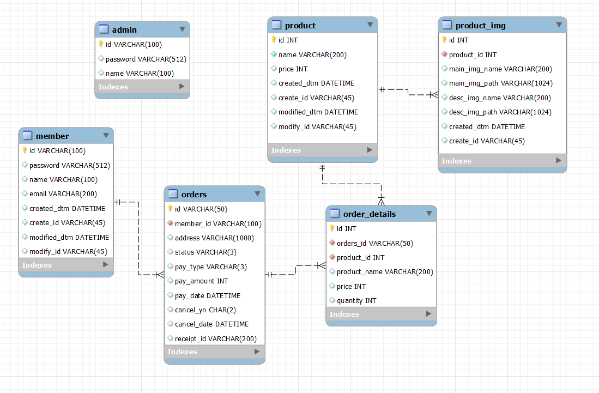
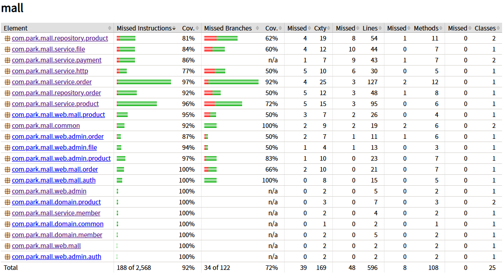

# 박신사 (온라인 쇼핑몰)
Spring Boot를 이용한 쇼핑몰 사이드 프로젝트 
(개인 포트폴리오 및 학습 목적으로 작성)

Spring Boot 기술들을 학습하기 위해 만들었으며 온라인 쇼핑몰의 기능을 최대한 간소화하여 간단하게 제작하였습니다.

## 백엔드 기술

* Spring Boot 3.4.1 (JDK 17)
* Spring Security : Session 방식 인증이며 관리자와 쇼핑몰 인증 분리 구현
* JPA + Querydsl + Native Query 등 데이터 접근 기술 사용
* mysql connector
* Thymeleaf
* Jasypt : 설정 파일 보안 적용 (jasyptKey : mypasswordkey)
* validation : hibernate.validator
* test
	* spring-boot-starter-test (junit5, Mockito, MockMvc)
	* spring-security-test (@WithMockUser, csrf())

## 프론트엔드 기술

* Bootstrap 5
* JQuery 3.7.1
* grid 라이브러리
	* simple-datatables
	* jqGrid
	* Grid.js
* Chart.js
	* Line Chart
	* Bar Chart

## 결제 모듈

부트페이(bootpay)
* 결제요청
* 결제승인(검증)
* 결제취소

## 시연 영상

### [관리자 시연 유튜브](https://www.youtube.com/watch?v=DZfCUBZA4yg)

## ERD

## 테스트 커버리지

* 라인 커버리지 테스트 통과 기준 : CLASS 단위 검사, 70%
* 전체 라인 커버리지 91% (48 / 596)

## 템플릿 참조

* 어드민 : https://startbootstrap.com/template/sb-admin
* 박신사 : chatgpt를 활용한 퍼블리싱

